## Configuració de xarxa
Primer de tot hem de posar la primera xarxa de cada màquina en Xarxa NAT.

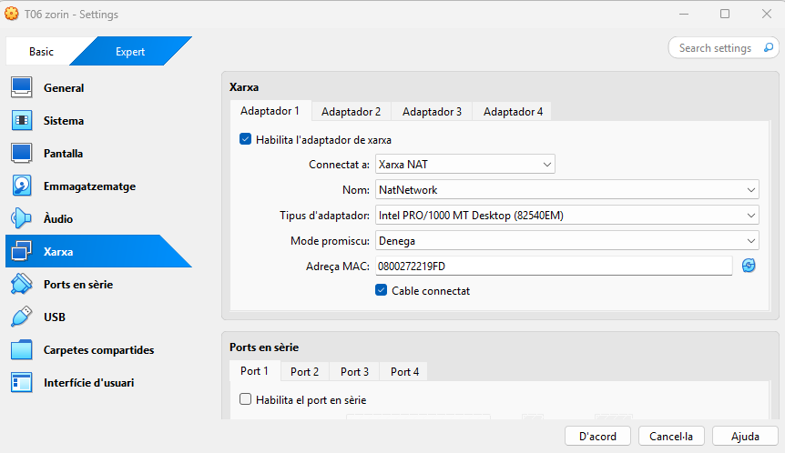
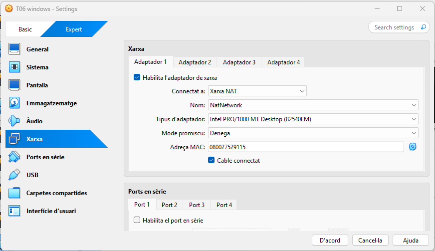

## Configuració de Windows
Per configurar el Windows hem d'anar a Sistema. Dins de sistema a Escritorio remoto.

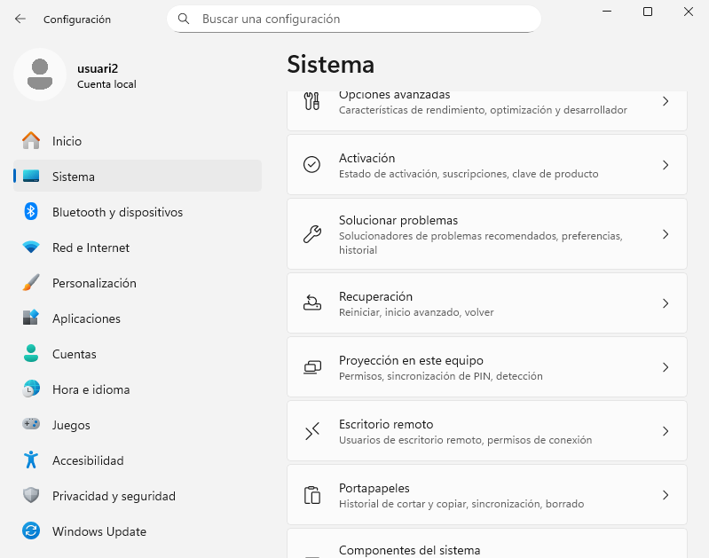

Dins activem l'escritori remot, li donem a confirmar.

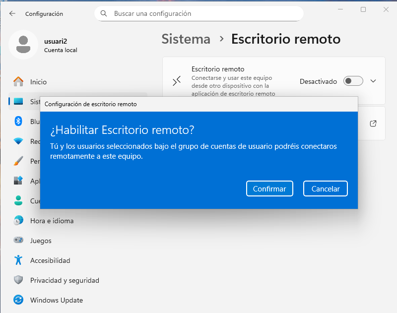

Seguidament, agreguem un usuari per fer l'escritori remot, anem dins de Usuarios de Escritorio remoto.

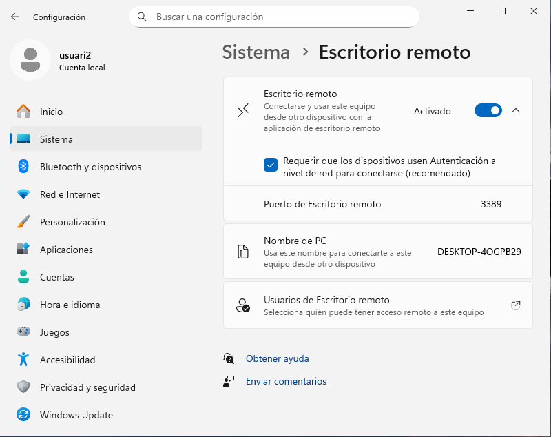

Dins a Agregar.

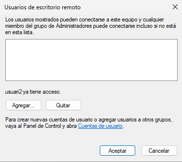

I agreguem el nostre usuari. Confirmem que estigui tot bé clicant a Comprobar nombres (si el text es posa subrallat es que està bé).

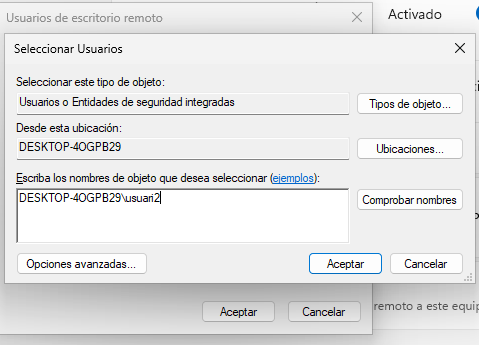

Per últim mirem que estigui l'usuari asignat.

## Connexió Zorin a Windows
Desde la màquina Zorin entrem a l'aplicació Remmina

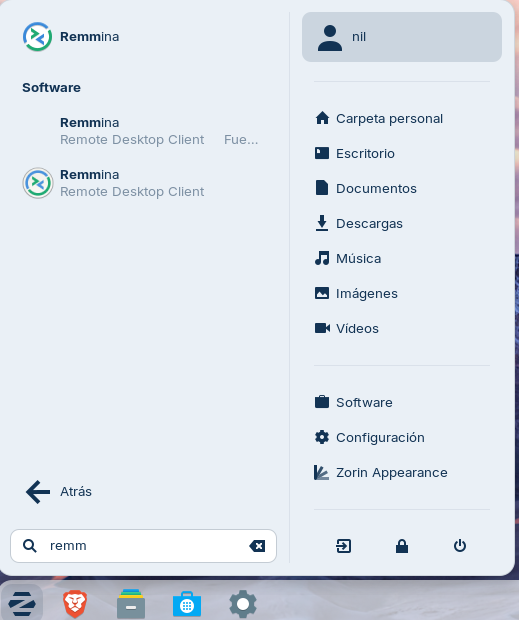

Mentres entra a l'aplicació mirem la ip de l'altre màquina.

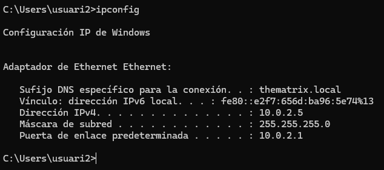

Dins la màquina Zorin posem la ip de l'altre màquina.

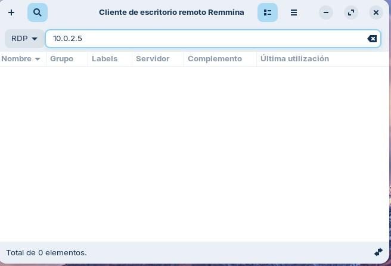

Li donem a si.

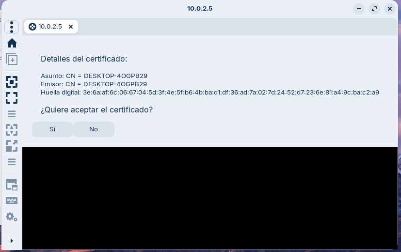

Li posem l'usuari i contrasenya del compte que abans hem habilitat.

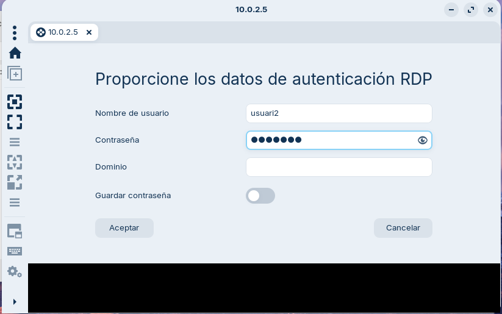

Ja estaria connectat.

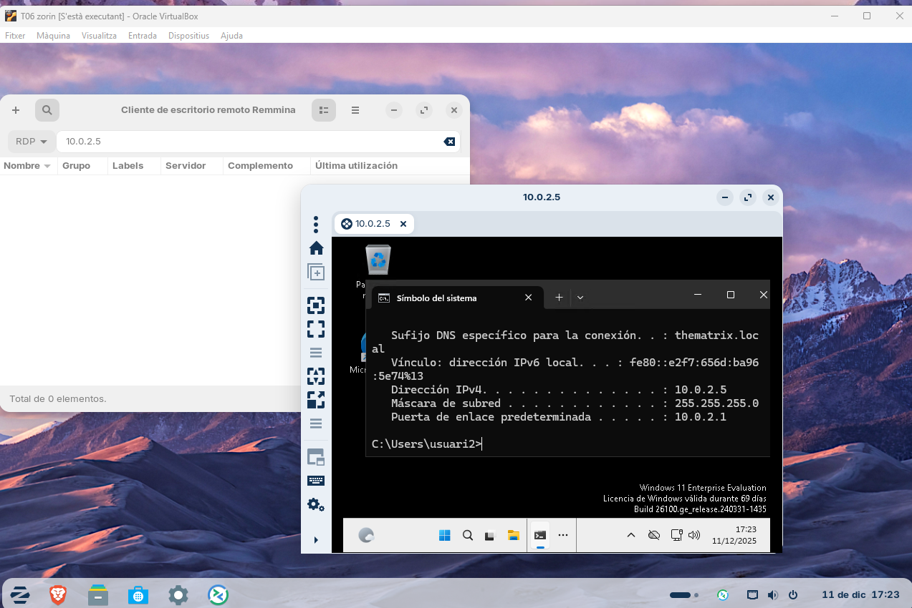

## Configuració de Zorin
Dins de la configuració de Zorin anem a l'apartat de Sistema.

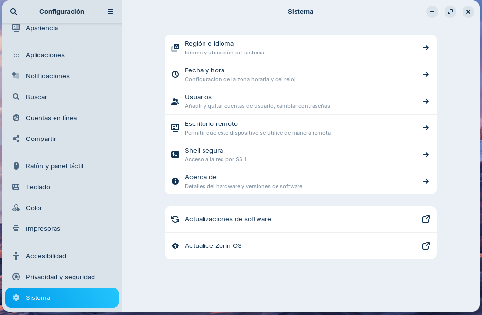

Habilitem les dos opcions que ens surten per poder compartir el escritori i tenir el control remot. Ens haurem de fixar en els detalls de inici de sessió ja que el usuari i la contrasenya (la posa aleatoria) son les credencials que tindrem que posar quan fem la connexió.

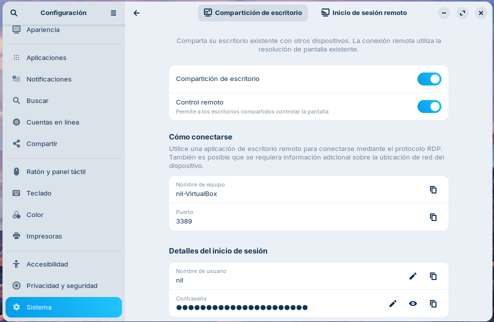

## Connexió Windows a Zorin
Anem a la connexió de escritori remot

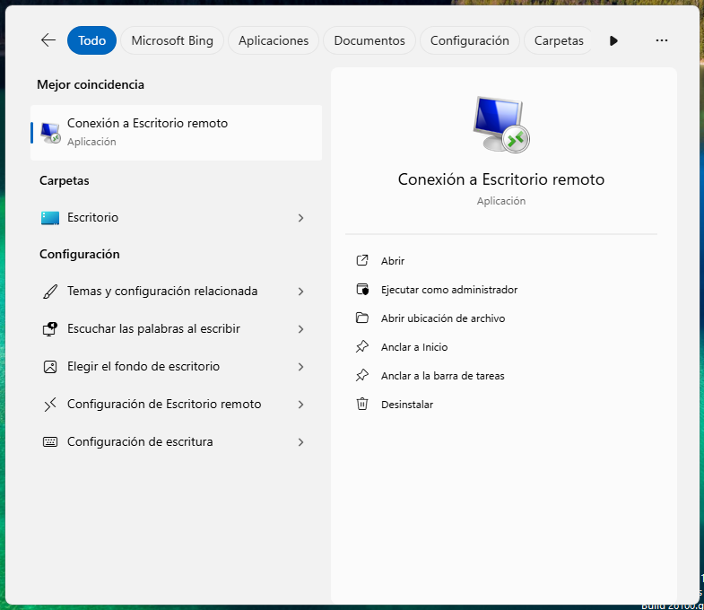

Fem ip a en l'altre màquina com hem fet abans (però en l'altre màquina d'abans). 

Dins de l'aplicació de la màquina Windows posem la ip que hem consultat.

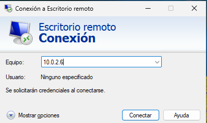

Ara li posem les credencials que he esmentat abans.

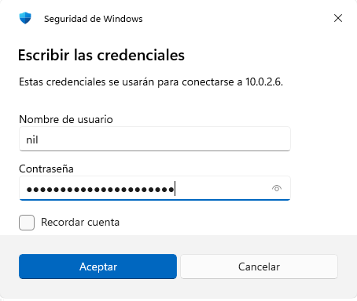

Li donem que si.

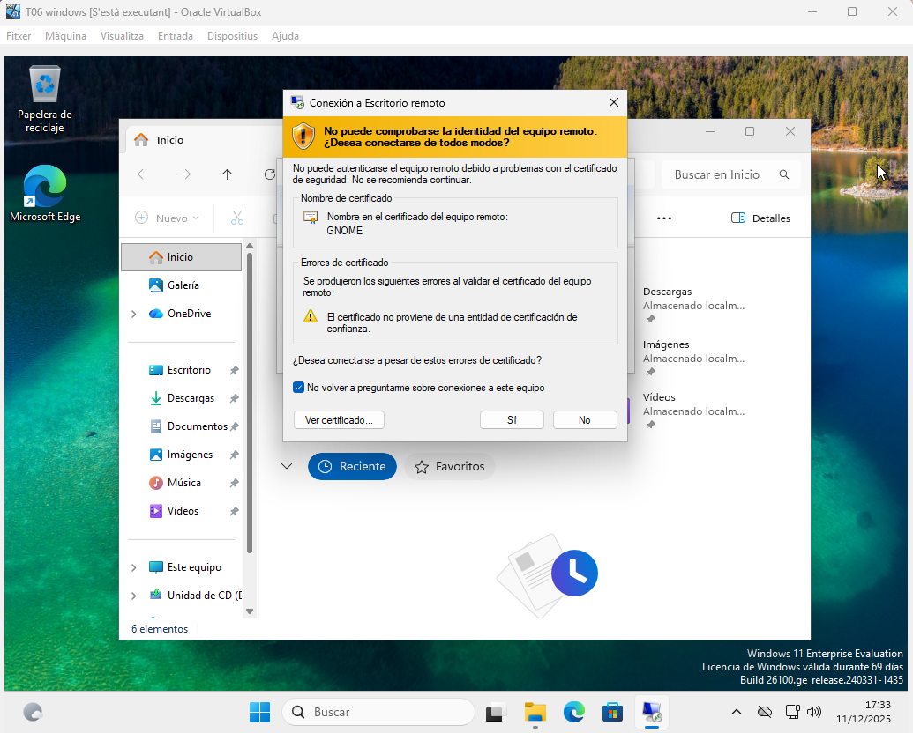

I ja estariam connectats.

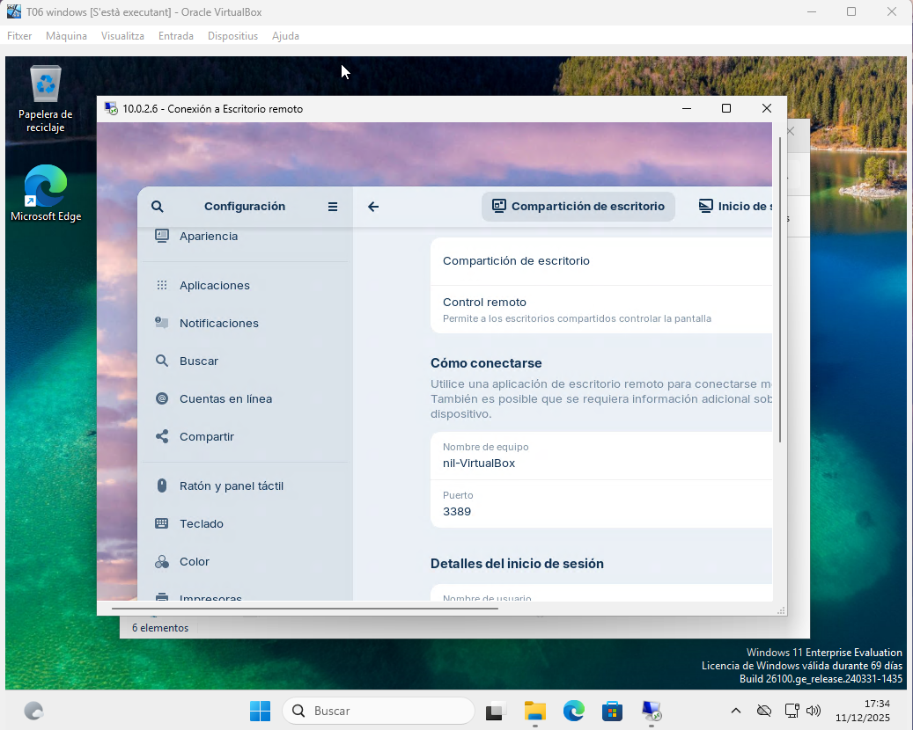
