# Fase 1: Preparació de l'entorn
Primer de tot haurem de configurar las xarxes de les dues màquines.
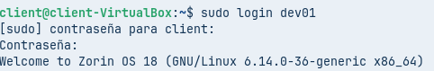


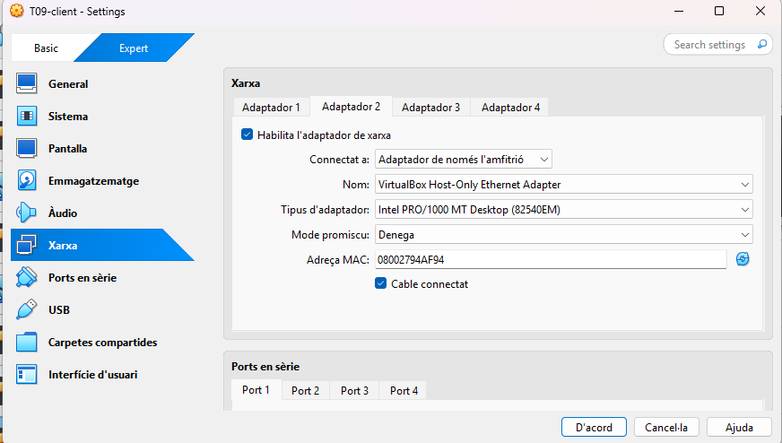

En el procés d'instal·lació de la màquina del server hem d'habilitar l'opció d'instal·lar el OpenSSH.
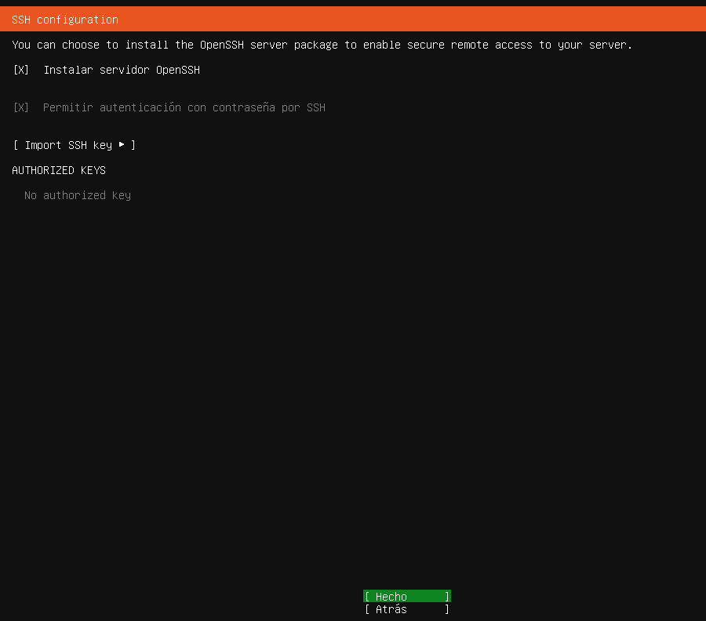

Seguidament, instal·lem el SSH en la màquina de client.
```
sudo apt install ssh
```
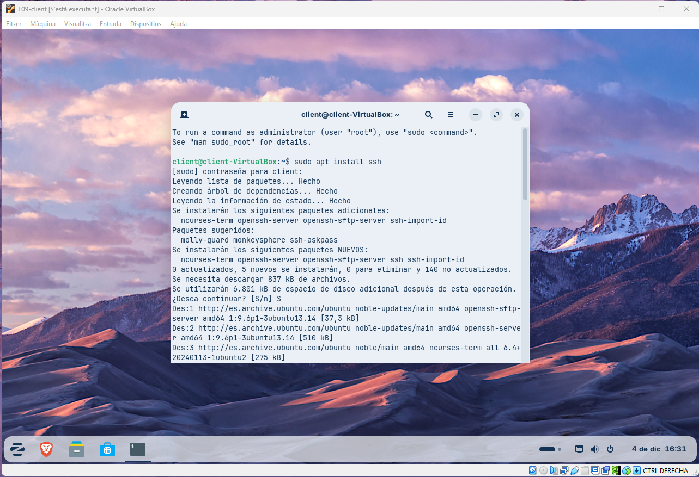

Mirem que vagin el les dues màquines.
```
ping 127.0.0.1
```

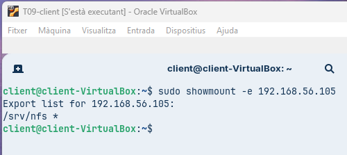

```
ping 127.0.0.1
```


I per acabar la fase 1 actualitzem les dues màquines.
```
sudo apt upgrade && sudo apt update
```

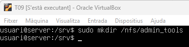

```
sudo apt upgrade && sudo apt update
```


# Fase 2: Preparació del servidor

```
sudo groupadd devs
sudo groupadd admins
```

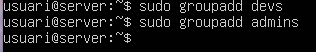

```
sudo useradd dev01
sudo usermod -aG devs dev01
```

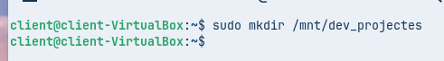

```
sudo useradd admin01
sudo usermod -aG admins admin01
```

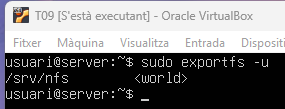


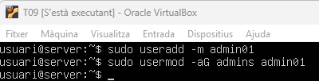

```
cd /srv
sudo mkdir /nfs
sudo mkdir /nfs/devs_projectes
```


```
sudo mkdir /nfs/admin_tools
```


```
cd /nfs
sudo chown root:devs dev_projectes
sudo chown root:admins admin_tools
```

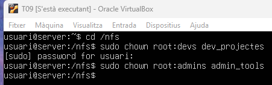

```
sudo chmod 770 dev_projectes
sudo chmod 770 admin_tools
```

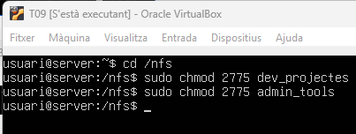

```
sudo apt install nfs-kernel-server -y
```

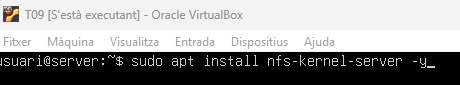


```
systemctl status nfs-server
```

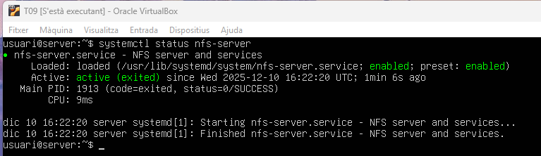

```
sudo nano /etc/exports
```


```
/srv/nfs *(rw,sunc,no_subtree_check)
```

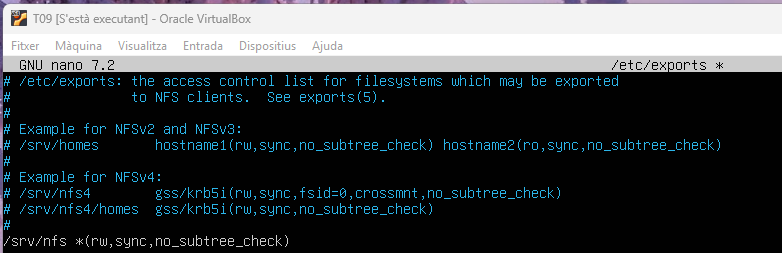

```
sudo systemctl restart nfs-kernel-server
```


```
sudo exportfs -u
```


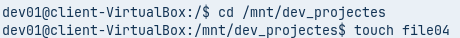

```
ip a
```


```
sudo rpcinfo -p 192.168.56.105
```

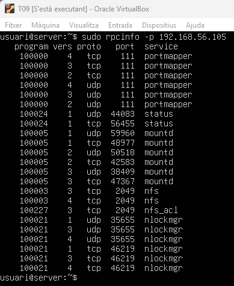

```
sudo apt install nfs-common -y
```

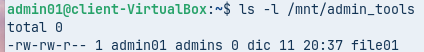

```
sudo showmount -e 192.168.56.105
```

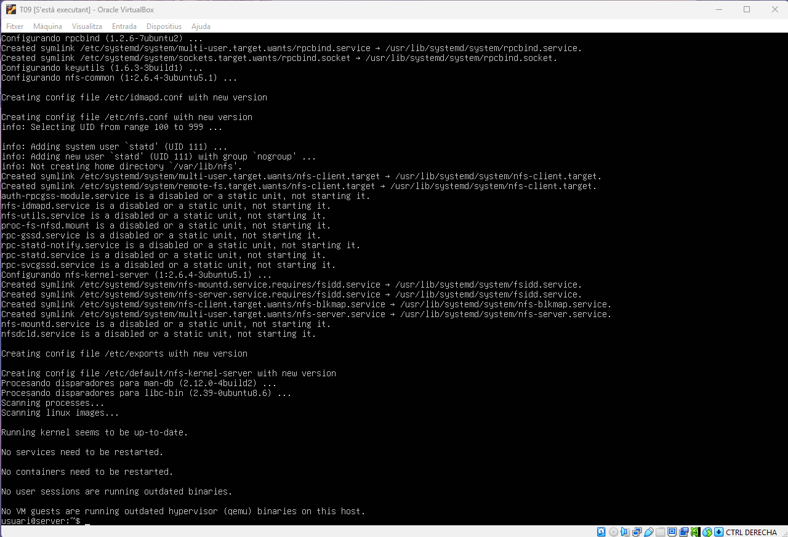

# Fase 3: L'Exportació d'Administració (El Dilema del root_squash)

```
sudo mkdir /mnt/admin_tools
```

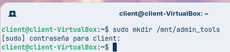

```
sudo mount -t nfs 192.168.56.105:/srv/nfs/admin_tools /mnt/admin_tools
```

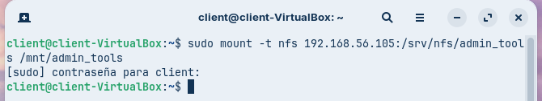


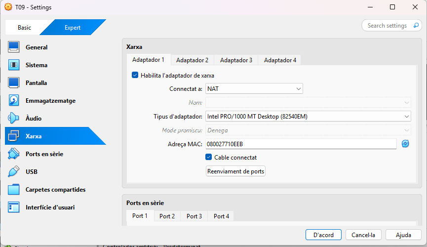


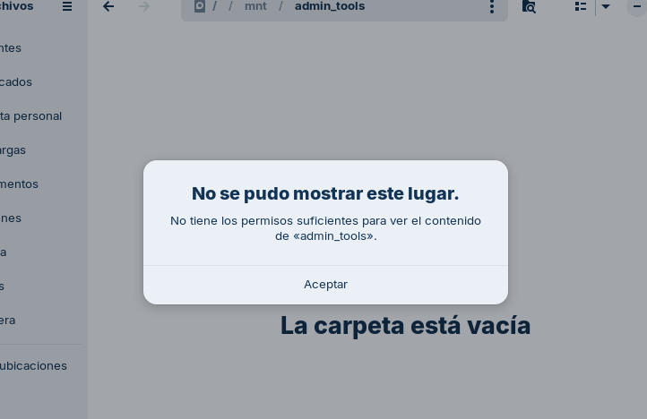

```
sudo login admin01
```

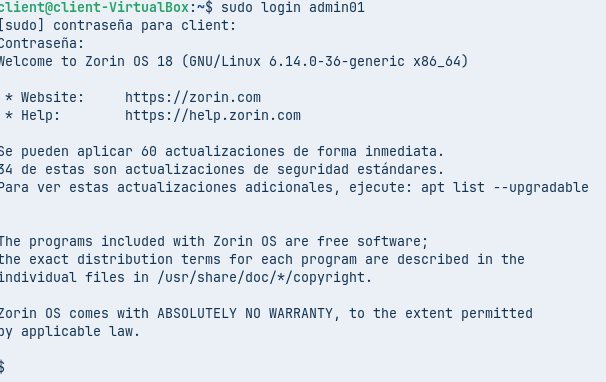

```
bash
```

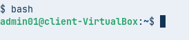

```
touch /mnt/admin_tools/file01
```

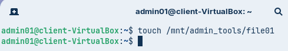

```
ls -l /mnt/admin_tools
```


```
sudoi nano /etc/exports
```


```
/srv/nfs/admin_tools *(rw,sync,no_subtree_check,no_root_squash)
/srv/nfs/dev_projectes *(rm,syn,no_subtree_check)
```

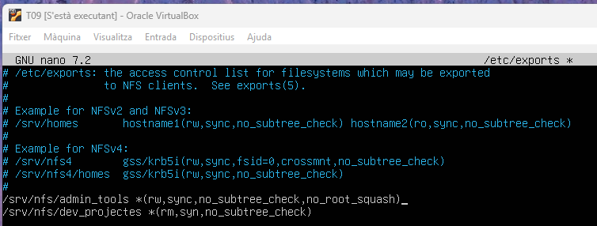

```
sudo systemctl restart nfs-kernel-server
```

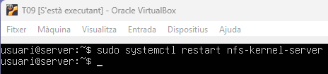

```
sudo umount /mnt/admin_tools
sudo mount 192.168.56.105:/srv/nfs/admin_tools /mnt/admin_tools
```

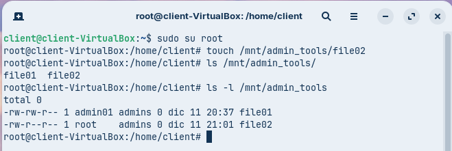

```
sudo su root
touch /mnt/admin_tools/file02
ls /mnt/admin_tools/
ls -l /mnt/admin_tools/
```


# Fase 4:

```
sudo nano /etc/exports
```

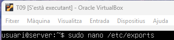

```
/srv/nfs/admin_tools *(rw,sync,no_subtree_check,no_root_squash)
/srv/nfs/dev_projectes 192.168.56.0/24(rm,syn,no_subtree_check)
/srv/nfs/dev_projectes 192.168.56.140(ro,sync,no_subtree_check)
```


```
sudo systemctl restart nfs-kernel-server
```

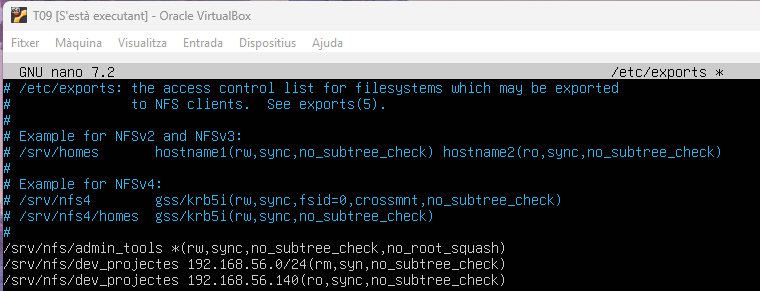

```
sudo mkdir /mnt/dev_projectes
```

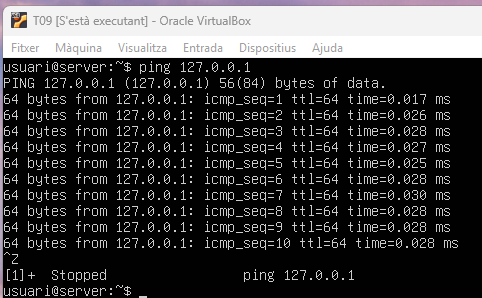


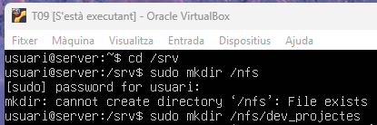


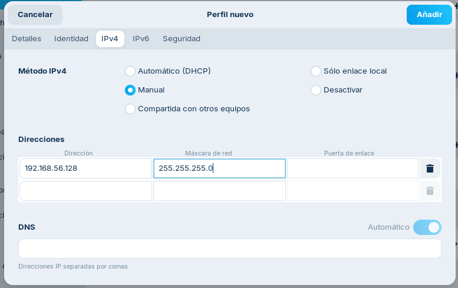

```
sudo mount 192.168.56.105:/srv/nfs/dev_projectes /mnt/dev_projectes
```

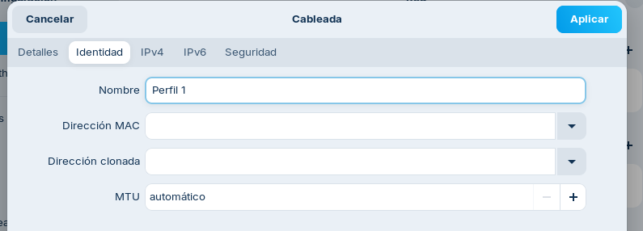

```
sudo login dev01
```


```
cd /mnt/dev_projectes
touch file04
```


```
ls
```

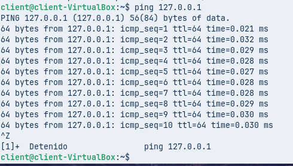


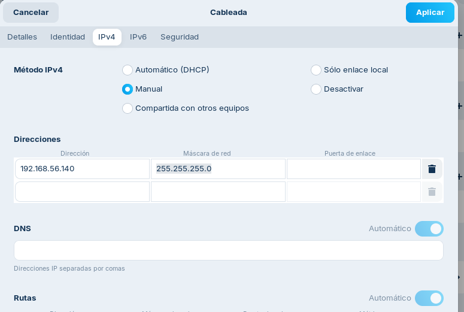

```
sudo su root
cd /mnt/dev_projectes/
ls
```

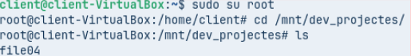

```
touch file05
```


```
touch /mnt/dev_projectes/file06
```


# Fase 5:

```
sudo nano /etc/fstab
```


```
192.168.56.105:/srv/nfs/admin_tools /mnt/admin_tools nfs defaults 0 0
192.168.56.105:/srv/nfs/dev_projectes /mnt/dev_projectes nfs defaults 0 0
```

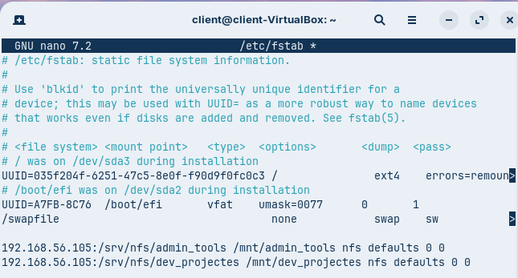

```
sudo su root
cd
cd /media
ls -l /mnt/
```

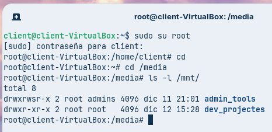

